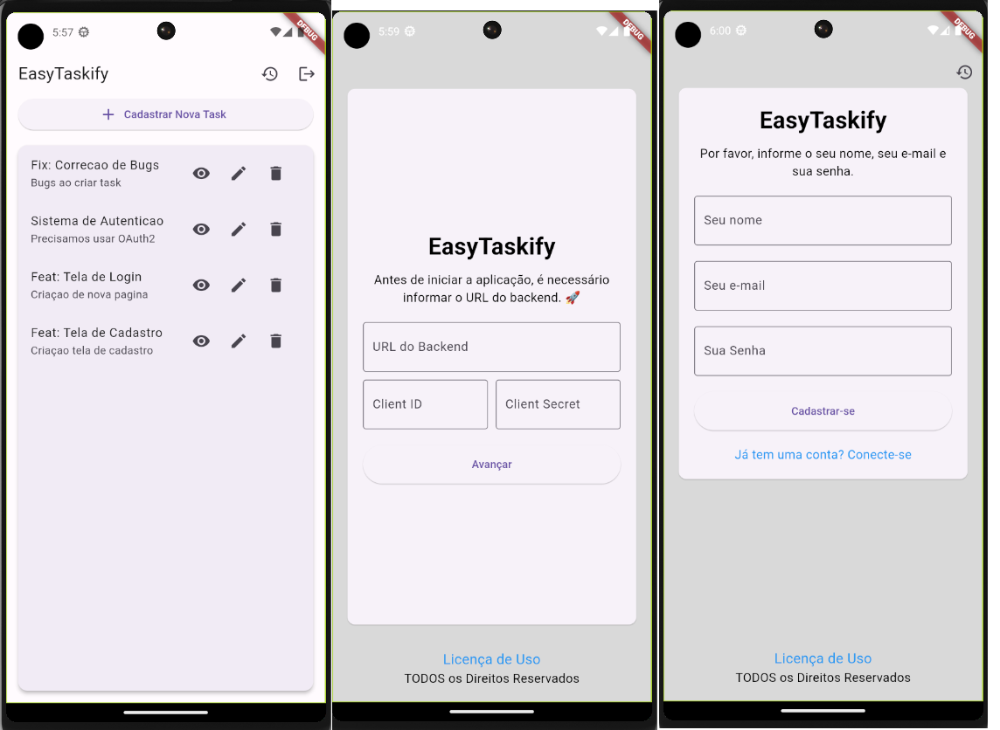

# EasyTaskify

## Sobre

EasyTaskify é um aplicativo de gerenciamento de tarefas multiplataforma desenvolvido usando Flutter para front-end móvel e uma estrutura Laravel baseada em PHP para back-end de API RESTful. Este projeto permite que os usuários criem, visualizem, atualizem e excluam tarefas de maneira integrada, com a interação de dados facilitada por meio de autenticação segura.

## Versões das Tecnologias Utilizadas

- Flutter: 2.16.8
- Dart: 3.2.5
- Laravel: 8.83.27
- PHP 8.3.1 (cli)
- MySQL: 8.0.36

## Estrutura de Documentação

Este repositório possui uma estrutura organizada de documentação para o aplicativo Flutter e o Backend Laravel.

### Documentação Flutter

- [Arquitetura do App Flutter](documentation/flutter_app/architecture.md)
- [Instruções de Instalação Flutter](documentation/flutter_app/installation.md)
- [Integração da API Flutter](documentation/flutter_app/api_integration.md)

### Documentação Laravel Backend

- [Arquitetura do Backend Laravel](documentation/laravel_backend/architecture.md)
- [Instruções de Instalação do Backend Laravel](documentation/laravel_backend/installation.md)
- [Configuração do Banco de Dados no Backend Laravel](documentation/laravel_backend/database.md)
- [Endpoints da API no Backend Laravel](documentation/laravel_backend/api_endpoints.md)

## Instruções Gerais

Este README serve como um guia de navegação para a documentação do projeto. Certifique-se de explorar a documentação específica para as tecnologias que você está usando. Se tiver dúvidas ou encontrar problemas, consulte os documentos relevantes ou entre em contato com a equipe de desenvolvimento.

;